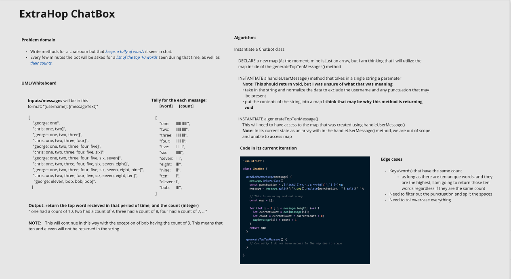

# ExtraHop chatBot

## Notes:
- My current approach is an O(n * length of array)
- Tests are to come

## Problem domain
Write methods for a chatroom bot that keeps a tally of words it sees in chat. Every few minutes the bot will be asked for a list of the top 10 words seen during that time, as well as their counts.
 
You can use either a class-based or a functional solution.

## Approach 
I am utilizing class based methods class-based methods

### White Board

